# URL Shortener - DevOps Projesi

Bu proje, daha önce geliştirdiğim `email-service-devops` projesindeki DevOps pratiklerini tekrar ederek pekiştirmek amacıyla sıfırdan kurduğum ikinci bir çalışma. Amaç yeni bir uygulama yazmak değildi. Amaç aynı production-grade DevOps akışını, Docker'dan Kubernetes'e, Helm'den GitOps'a, monitoring'den autoscaling'e kadar, bir kez daha ve bu sefer daha fazla "neden"i sorgulayarak elle kurmaktı.

Uygulamanın kendisi kasıtlı olarak basit tutuldu, bir URL kısaltma servisi: Flask + SQLite. Asıl odak, bu küçük uygulamanın etrafına kurulan altyapı.

## Mimari

```
Geliştirici (push)
      │
      ▼
   GitHub  ──────────────► GitHub Actions (CI)
      │                     ├─ Docker build
      │                     ├─ Trivy (image güvenlik taraması)
      │                     └─ Checkov (IaC güvenlik taraması)
      │
      ▼ (ArgoCD sürekli izliyor)
   ArgoCD  ──────────────► Kubernetes Cluster (minikube)
                            ├─ Deployment (3 replica, HPA ile 2-5 arası)
                            ├─ Service (NodePort)
                            ├─ HPA (CPU %70 hedef)
                            ├─ Secret (ADMIN_TOKEN)
                            └─ ServiceMonitor
                                   │
                                   ▼
                            Prometheus ──► Grafana (dashboard)
```

Deploy akışı klasik "push" mantığında değil, GitOps mantığında çalışıyor. Ben `kubectl apply` demiyorum, sadece Git'e push ediyorum. ArgoCD Git'teki tanımla cluster'ın gerçek durumunu sürekli karşılaştırıp farkı otomatik kapatıyor.

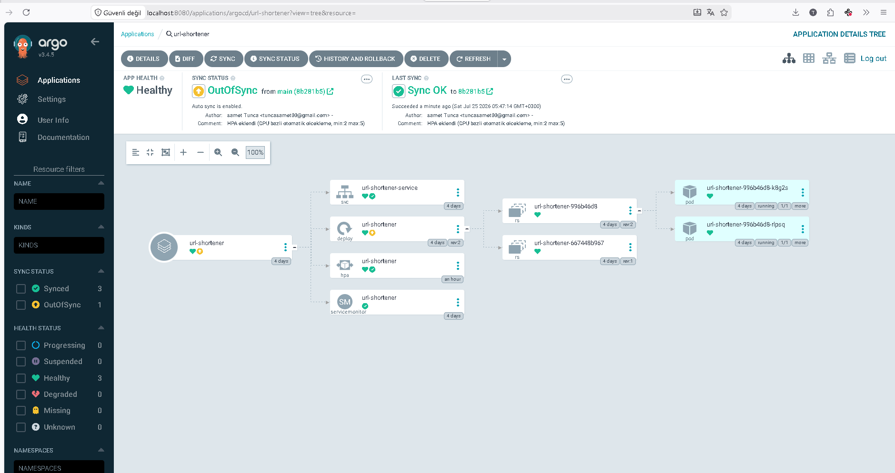

## Kullanılan Teknolojiler

- **Uygulama** — Flask + SQLite. Basit tutup asıl odağı DevOps'ta bırakmak için.
- **Container** — Docker, multi-stage build, non-root user. Küçük ve güvenli image için.
- **CI** — GitHub Actions. Build ve güvenlik taraması otomasyonu.
- **Image güvenliği** — Trivy. Bilinen CVE taraması.
- **IaC güvenliği** — Checkov. Helm chart'ın kendisindeki konfigürasyon hatalarını yakalamak için.
- **Orkestrasyon** — Kubernetes, minikube üzerinde. Deployment, Service, health check, autoscaling.
- **Paketleme** — Helm. Ortam bazlı parametrik konfigürasyon.
- **GitOps** — ArgoCD. Git tek doğruluk kaynağı, otomatik senkronizasyon.
- **Monitoring** — Prometheus + Grafana. Metrik toplama ve görselleştirme.
- **Log toplama** — Loki. Kısmen kuruldu, aşağıda notu var.
- **Secrets** — Kubernetes Secret. Hassas veriyi Git'ten ayrı tutmak için.

## Uygulama Mantığı

İki endpoint var:

- `POST /shorten` — uzun bir URL alır, 6 karakterlik rastgele bir kod üretir, çakışma kontrolü yapar, SQLite'a yazar, kısa linki döner.
- `GET /<kod>` — kodu SQLite'ta arar, bulursa orijinal URL'ye yönlendirir, bulamazsa 404 döner.

Ayrıca `/health` var, Kubernetes probe'ları için, ve `/metrics` var, Prometheus için, `prometheus-flask-exporter` kütüphanesiyle.

```
POST /shorten
Body: {"url": "https://github.com"}
Response: {"kisa_link": "http://.../aB3f9K"}
```

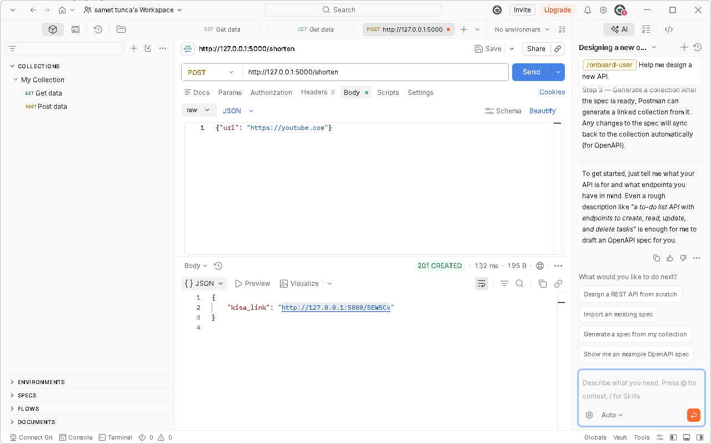

## Kurulum ve Çalıştırma

Aşağıdaki adımlar local'de, minikube üzerinde, projeyi ayağa kaldırmak için.

**1. Image'ı minikube'ün içine build et**

```bash
minikube image build -t url-shortener:latest .
```

**2. Secret'ı elle oluştur.** Secret Git'e commit edilmiyor, bilerek.

```bash
kubectl create secret generic url-shortener-secrets --from-literal=admin_token=<değer>
```

**3. ArgoCD Application'ı uygula**

```bash
kubectl apply -f argocd-application.yaml
```

Bundan sonrası otomatik: ArgoCD, `url-shortener-chart/` altındaki Helm chart'ı Git'ten okuyup cluster'a deploy ediyor, `selfHeal: true` sayesinde manuel bir müdahaleye gerek kalmıyor.

**4. Servise erişim**

```bash
minikube service url-shortener-service --url
```

Grafana'da uygulamanın canlı metriklerini izlediğim dashboard:

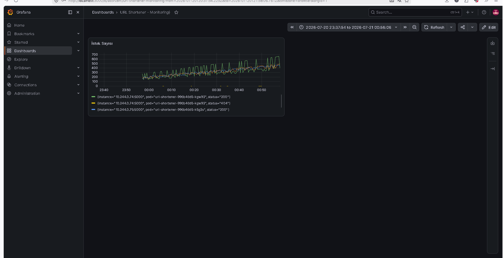

## Karşılaşılan Sorunlar ve Çözümleri

Bu bölümü bilerek ayrıntılı tuttum, çünkü öğrendiğim asıl şeyler burada. Her şeyin ilk seferde çalıştığı bir proje anlatısı gerçekçi değil.

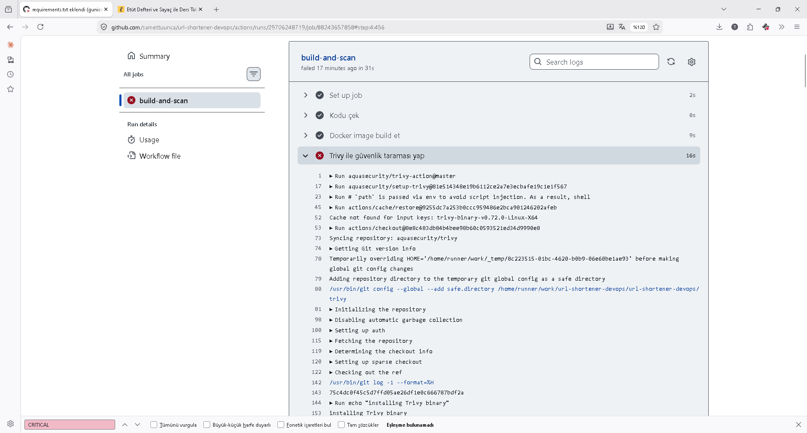

### 1. Docker volume, uygulama kodunu gizledi

Docker volume'ü `/app` klasörünün tamamına bağladığımda, boş volume `app.py`'nin üzerine binip onu görünmez hale getirdi, gunicorn "uygulamayı bulamıyorum" hatası verdi. Çözüm: veritabanını `/app/data` gibi ayrı bir alt klasöre taşımak, volume'ü sadece o klasöre bağlamak. Ders: volume'ü asla kodun bulunduğu klasörle aynı yere bağlama.

### 2. Docker volume izin hatası

Volume ilk oluşturulduğunda sahipliği root'a ait oluyordu, non-root kullanıcı olan `appuser` yazamıyordu. `sqlite3.OperationalError: unable to open database file` hatası aldım. Geçici bir `alpine` container'la volume'ün izinlerini düzelttim.

### 3. CrashLoopBackOff — yanlış health check path

Kubernetes'e liveness/readiness probe eklerken `path: /` yazdım, ama uygulamada `/` route'u hiç yoktu. Probe sürekli 404 alıyor, Kubernetes pod'u "sağlıksız" sayıp sürekli yeniden başlatıyordu. `kubectl describe pod` ile Events kısmına bakarak teşhis ettim, `/health` adında ayrı, hafif bir endpoint ekleyip sorunu çözdüm.

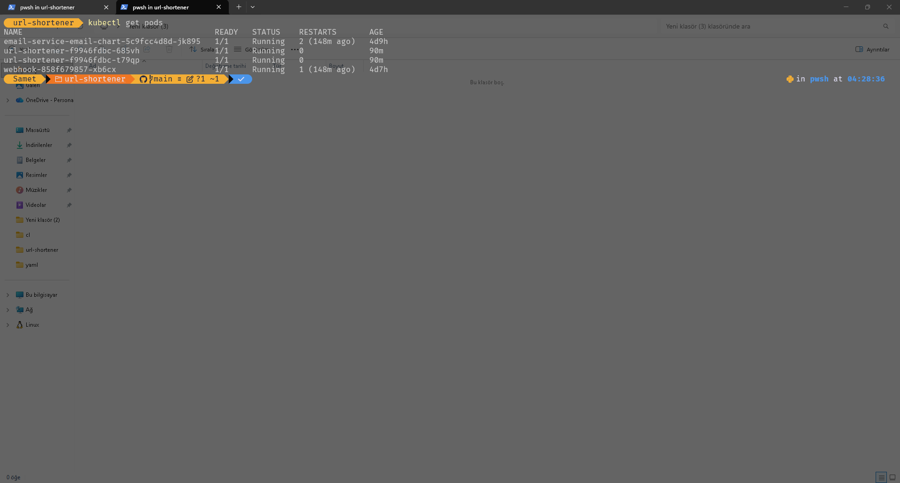

### 3.5 Helm chart kurulumunda yaşanan hatalar

`helm install` ilk denemede çalışmadı, birkaç farklı hata art arda geldi: yanlış klasörden çalıştırma, `NOTES.txt` içindeki artık var olmayan bir değere referans, ve chart klasörünün içine girip yolun kendisini bozma. Hepsini sırayla teşhis edip düzelttim.

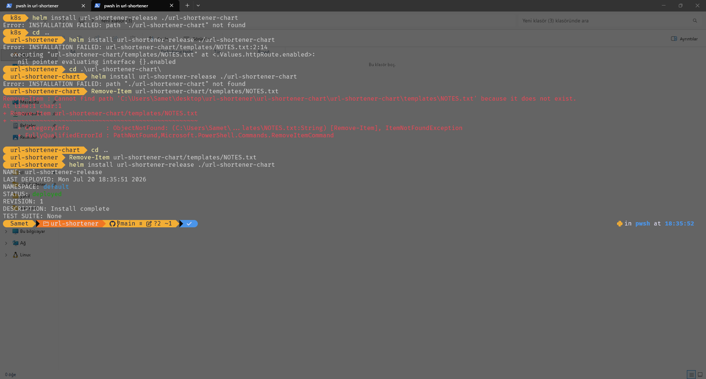

### 4. ServiceMonitor, Service'i bulamıyordu

Prometheus'a `ServiceMonitor` ile "şu Service'i izle" dedim ama Prometheus hiçbir şey toplamadı. Sebep: `ServiceMonitor`'ün `selector`'ı, Service'in `spec.selector`'ına değil, Service'in **kendi `metadata.labels`'ına** bakıyor. Benim Service'imde `metadata.labels` boştu, sadece `spec.selector` doluydu — ikisi farklı alanlar, biri "ben kimim" biri "kimi hedefliyorum" sorusuna cevap veriyor. Service'e `metadata.labels` ekleyince düzeldi.

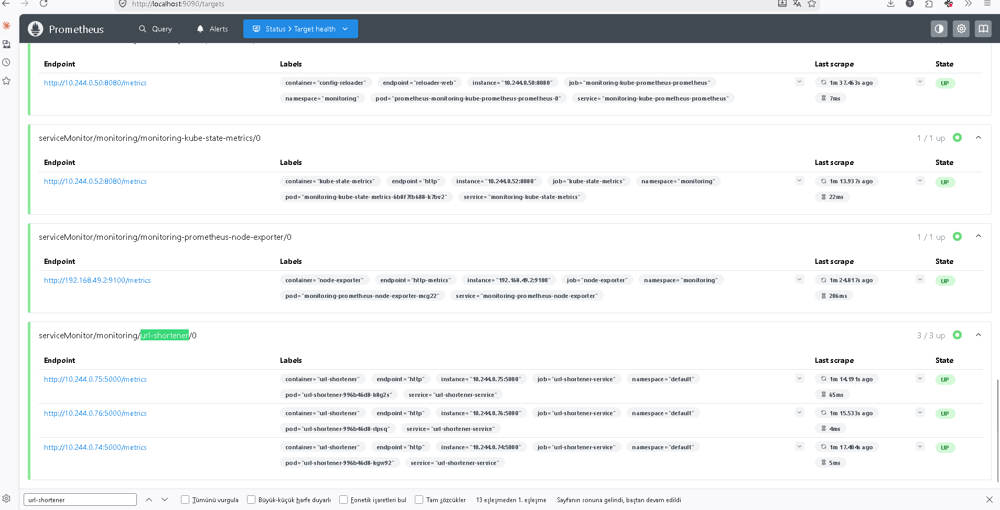

### 5. `runAsNonRoot` ile isim tabanlı kullanıcı çakışması

Checkov'un önerisiyle `securityContext.runAsNonRoot: true` eklediğimde pod'lar `CreateContainerConfigError` ile başlayamadı. Sebep şu: Dockerfile'da kullanıcıyı isimle, `USER appuser` diye, tanımlamıştım. Kubernetes bunun gerçekten root olmadığını sayısal olarak doğrulayamıyordu. `runAsUser: 1000` ekleyerek sayısal bir UID belirtince çözüldü.

### 6. Checkov bulguları

Checkov'u CI'a `soft_fail: true` ile entegre ettim, ilk kurulumda pipeline'ı durdurmadan önce hangi önerilerin geldiğini görmek istedim. 10 bulgudan altısını, `allowPrivilegeEscalation`, root container, securityContext eksikliği, capabilities gibi, `securityContext` bloğu ekleyerek çözdüm. Kalan dördü, image tag latest, imagePullPolicy Always, default namespace, service account token, bilinçli istisna. Sebepleri aşağıda.

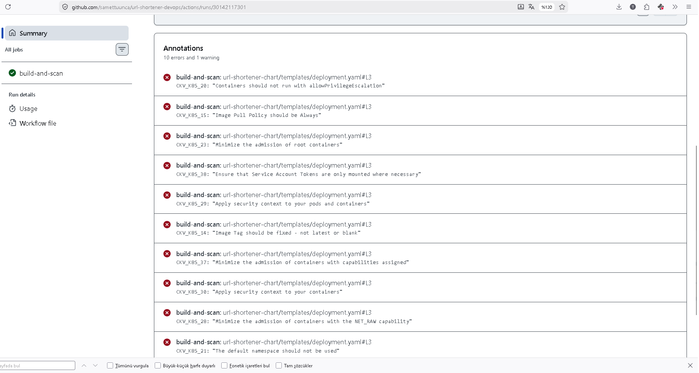

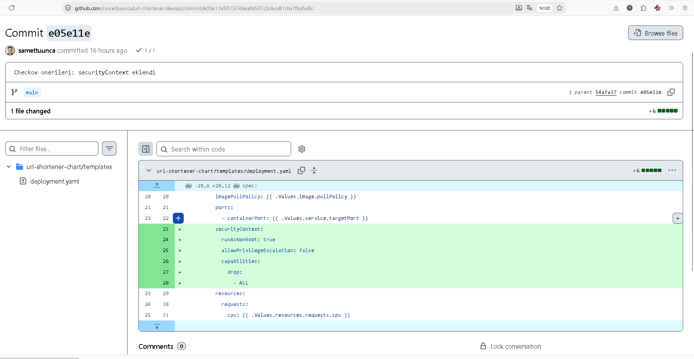

### GitOps ve otomatik ölçeklendirme testleri

Sadece kod yazıp "çalışıyor" demek yerine, bu iki mekanizmayı canlı olarak test ettim.

`values.yaml`'da replica sayısını değiştirip push ettiğimde, hiçbir `kubectl` komutu çalıştırmadan ArgoCD'nin cluster'ı otomatik güncellediğini gördüm:

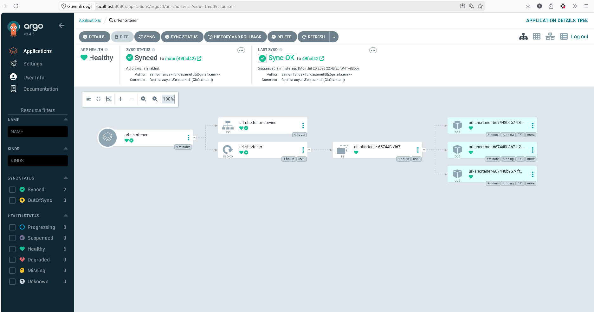

HPA'yı test etmek için `/shorten` endpoint'ine art arda 300 istek gönderdim, CPU kullanımının arttığını ve pod sayısının otomatik olarak yükseldiğini, sonra trafik durunca tekrar düştüğünü izledim:

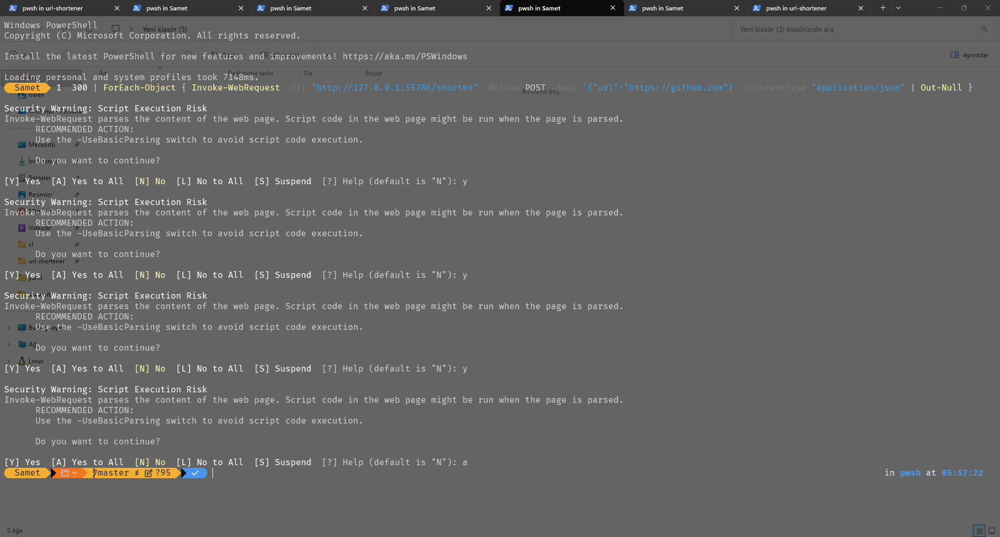

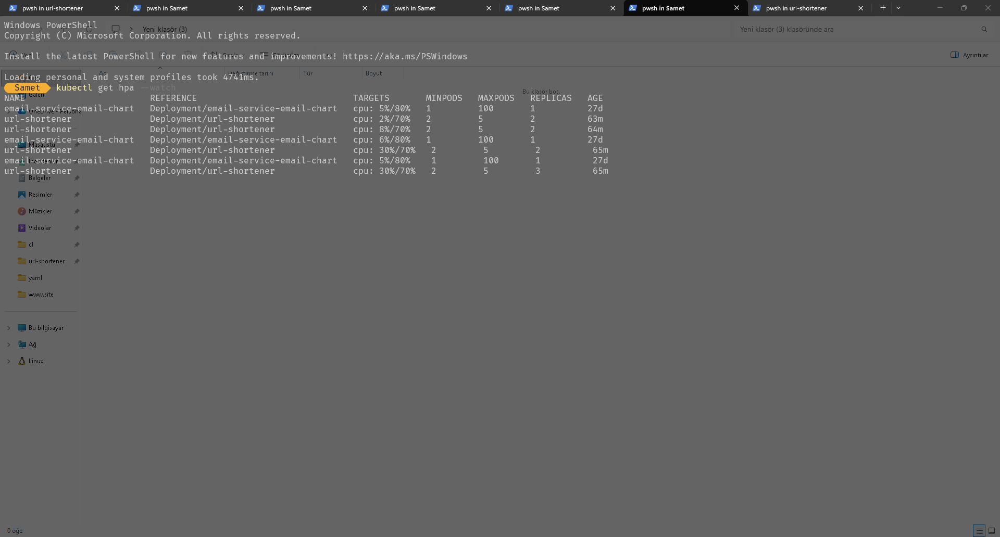

### Secrets management

`ADMIN_TOKEN` değerini koda ya da Helm values dosyasına yazmak yerine Kubernetes Secret olarak elle oluşturdum ve Deployment'a environment variable olarak bağladım. Secret Git'e hiç girmiyor.

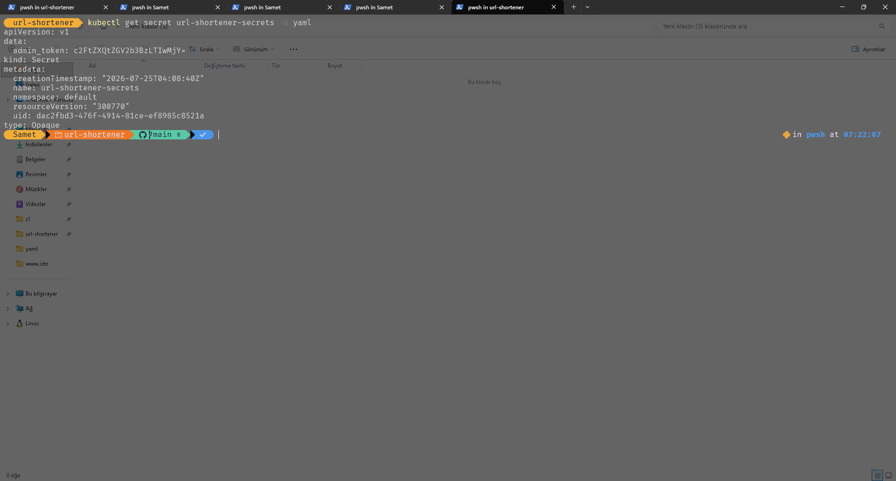

## Bilinçli Olarak Yapılmayan / Ertelenen Konular

Her Checkov/Trivy uyarısını kapatmak "her şeyi düzelttim" demek değil. Bazı öneriler bu projenin ortamında, local ve minikube üzerinde, uygulanabilir değil ya da gerekli değil:

- **Image tag `latest`** — Gerçek bir projede commit hash'i ile taglenmeli (`url-shortener:a1b2c3d`). Burada image registry'ye push edilmediği, sadece minikube'ün kendi içinde build edildiği için `latest` ile bıraktım.
- **`imagePullPolicy: Never`** — Image bir registry'de olmadığı için `Always` yerine `Never` kullandım. Production'da bu asla doğru olmaz.
- **`default` namespace kullanımı** — Uygulama kendi namespace'inde çalışmalı, ama tek uygulamalı bu projede ekstra karmaşıklık katmak istemedim.
- **Infracost eklenmedi** — Infracost, gerçek bulut kaynaklarının maliyetini tahmin ediyor, Terraform ile tanımlı AWS ya da GCP kaynakları üzerinden. Bu projede bulut kaynağı yok, uygulanabilir bir zemin yoktu.
- **Loki tam çalışmıyor** — Loki kuruldu, Grafana üzerinden sorgulamayı denedim, ancak promtail'in `default` namespace'indeki pod'ları, bu uygulama dahil, neden görmediğini tam olarak çözemedim. Loki'nin kendisinin daha önce kaynak yetersizliğinden çöktüğünü loglardan tespit edip yeniden başlattım, bu durumu düzeltti ama namespace filtreleme sorunu ayrı bir konu olarak kaldı. Üzerinde hâlâ çalıştığım bir konu.

## Klasör Yapısı

```
.
├── app.py                          # Flask uygulaması
├── Dockerfile                      # Multi-stage, non-root
├── requirements.txt
├── k8s/                            # ilk yazdığım ham manifest'ler, referans amaçlı, artık aktif kullanılmıyor
│   ├── deployment.yaml
│   └── service.yaml
├── url-shortener-chart/            # Aktif kullanılan Helm chart
│   ├── values.yaml
│   └── templates/
│       ├── deployment.yaml
│       ├── service.yaml
│       ├── hpa.yaml
│       └── servicemonitor.yaml
├── argocd-application.yaml
└── .github/workflows/ci.yml
```

`k8s/` klasörünü bilerek sildim, sadece güvenli hale getirdim: önce ham YAML'ı elle yazıp mantığını oturttum, sonra Helm'e taşıdım. İkisi arasındaki farkı görmek isteyen biri için duruyor.
